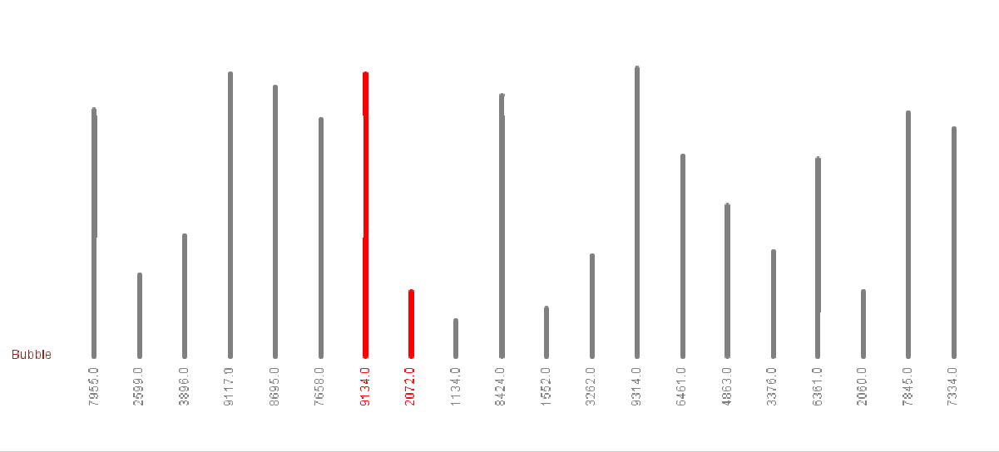
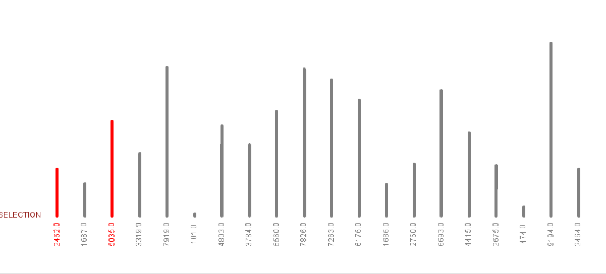
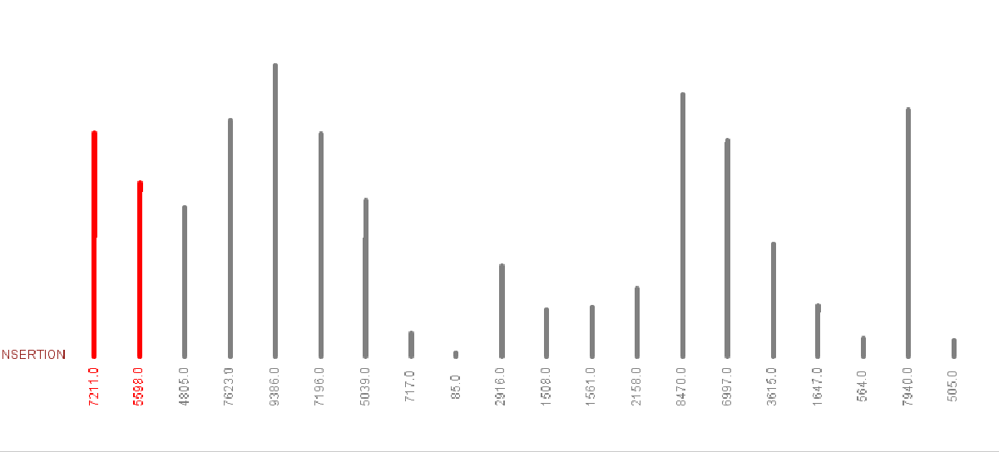
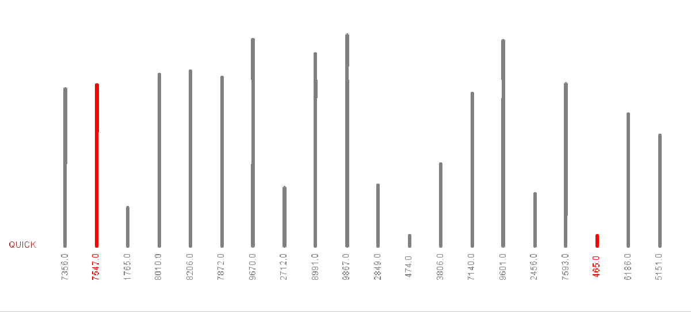
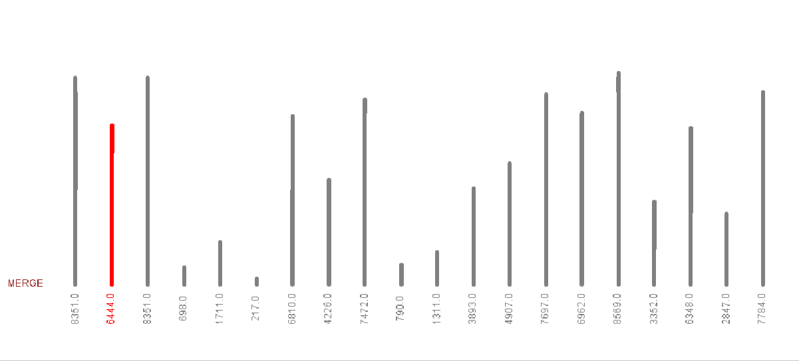
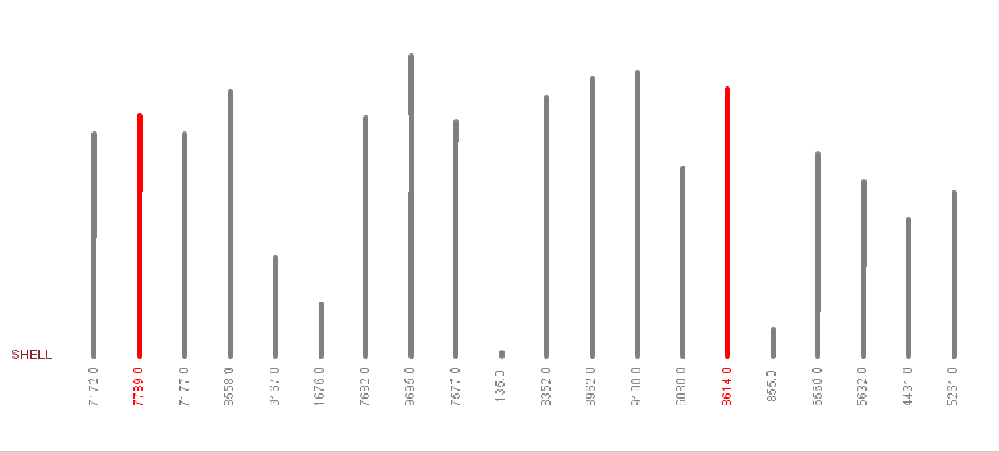

# Java implementation of commonly used sort functions

This is the visual implementation of sorting algorithms.
this code covers the following algorithms:

- [Bubble Sort]( http://en.wikipedia.org/wiki/Bubble_sort)
- [Selection Sort]( https://en.wikipedia.org/wiki/Selection_sort)
- [Insertion Sort]( http://en.wikipedia.org/wiki/Insertion_sort)
- [Quick Sort]( http://en.wikipedia.org/wiki/Quicksort)
- [Merge Sort]( http://en.wikipedia.org/wiki/Merge_sort)
- [Shell Sort]( https://en.wikipedia.org/wiki/Shellsort)

The implementation generates random unsorted double array based on user input and generates output both for CLI :desktop_computer: and GUI :bar_chart: using java `StdDraw` library.

## How it works
First of all, you should compile `allSorts.java` file using this command:
```bash
> javac allSorts.java
```
And to run the app, just run the command below. it will give some help for usage:
```bash
> java allSorts

Help:
java allSort [Algorithm Name] [Count] {delay}

Algorithm Names:
bubble:  Bubble Sort
selection: Selection Sort
insertion: Insertion Sort
quick: Quick Sort
merge: Merge Sort
shell: Shell Sort

Delay:
time for each compare to show graphics in Milisecond
```

## Demos
### Bubble Sort
```bash
> java bubble 20 100
```


### Selection Sort
```bash
> java selection 20 100
```


### Insertion Sort
```bash
> java insertion 20 100
```


### Quick Sort
```bash
> java quick 20 100
```



### Merge Sort
```bash
> java merge 20 100
```



### Shell Sort
```bash
> java shell 20 100
```

